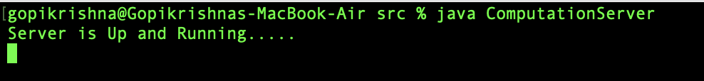
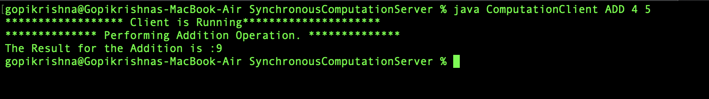
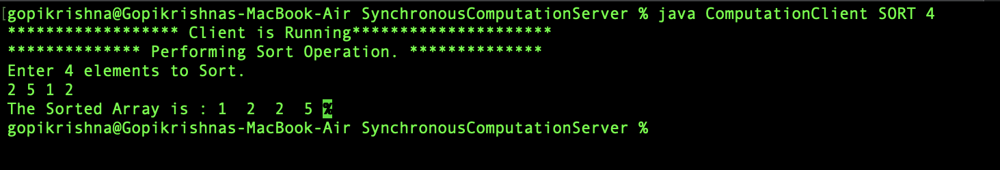

# COMPUTATION SERVER USING SYNCHRONIZATION RPC

## Supporting Operations
* ADD
* SORT

## Starting server
1.Open Terminal <br>
2.Go to Downloaded Project Directory

Perform the below operation to start the server

```bash
	1.cd DSCode/SynchronousComputationServer
	2.javac *.java
	3.java ComputationServer
```
### Server Start Output



## Starting Client 

Open New Terminal and perform below operations

```bash
	1.cd DSCode/SynchronousComputationServer
	2.javac *.java
```

## Performing Operations
### 1.ADD
Run the below command to perform ADD operation.

```bash
java ComputationClient ADD 4 5       
```
#### OUTPUT


### 2.SORT
Run the below command to perform SORT operation.

```bash
java ComputationClient SORT 4        
```
Above command ask you to enter the 4 elemnts to sort

#### OUTPUT

	